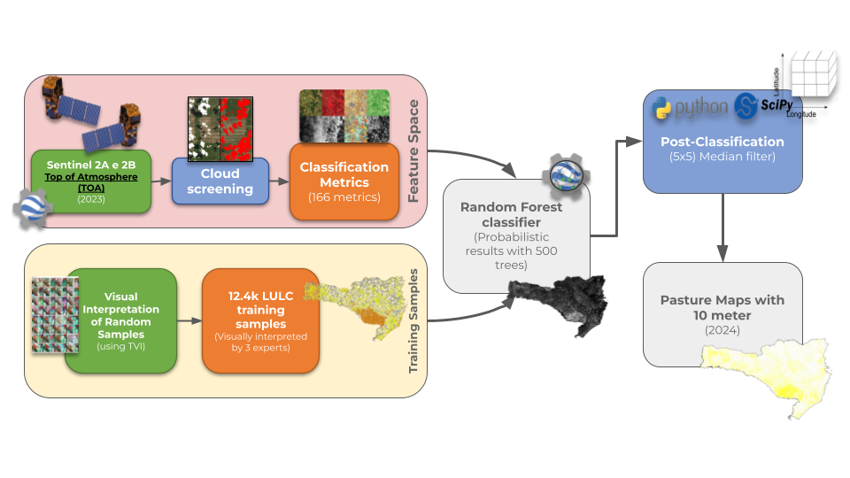
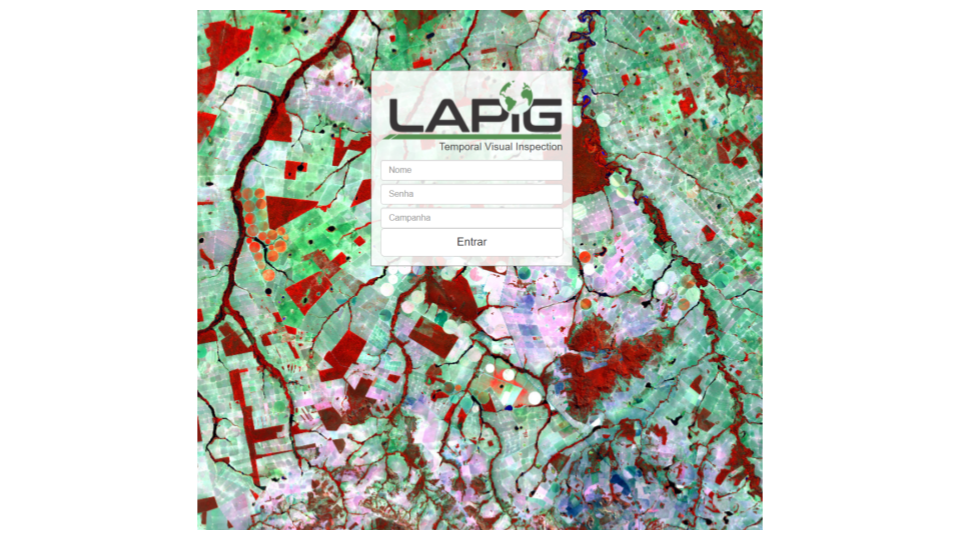
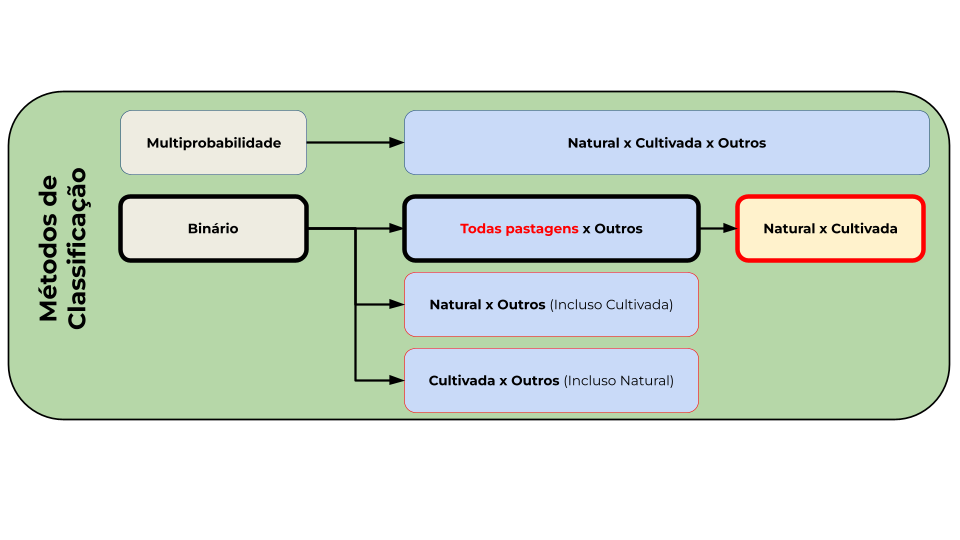
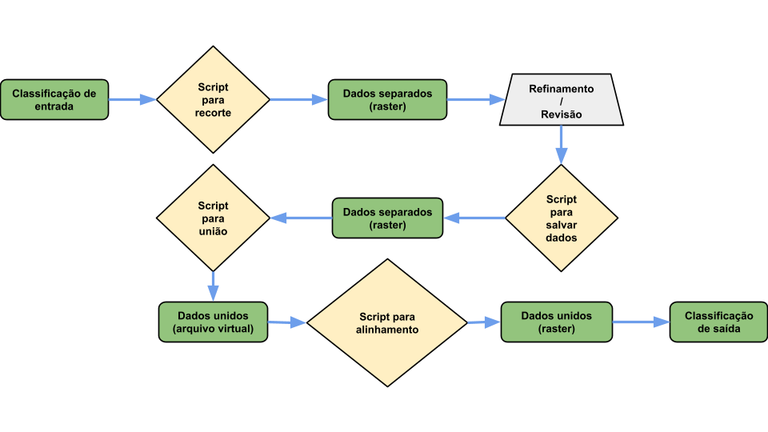

<h2 align="center"> Processos metodologicos</h2>

[//]: #(Sumario)

  
<b>Clique para ver o Sumário</b>

  <ol>
      <li><a href="#definicao">Definição de Metodologia</a></li>
      <li><a href="#desenho">Desenho Amostral</a></li>
      <li><a href="#inspecao">Inspeção Visual de Pontos</a></li>
      <li><a href="#classificacao">Classificação</a></li>
      <li><a href="#Preparacao">Preparação de dados para análise</a></li>
      <li><a href="#refinamento_e_auditoria">Refinamento e Auditoria</a></li>
  </ol>

[//]: #(Mapbiomas_carta_IBGE)
<h3 align="left" id="definicao">Definição de metodologia</h3>

 
    A metodologia de classificação utilizando o algoritmo Random Forest descrita no <a href=""> Documento Base Teórico de Algoritmos (ATBD) </a>, realizada pelo Mapbiomas (figura 1) foi base para projeto. Usar cartas do Instituto Brasileiro de Geografia e Estatística (IBGE) para delimitar regiões de classificação. Para cada carta, é utilizado as amostras da carta central e um buffer de 100 km da vizinhança para o treinamento do classificador. São 12 modelos no total.

 

[//]:#(imagem_metodologia)

    
    
<i>Figura 1: Procedimento metodologico do Mapbiomas para área de estudo.</i>

 

[//]: #(Desenho_amostral)
<h3 align="left" id="desenho">Desenho amostral</h3>

 
    Foi realizado o Sorteio aleatório estratificado proporcionalmente pelos estratos secundários e uniforme para as 3 classes resultantes das máscaras de referência (Mapbiomas uso e cobertura e Global Pasture Watch) ambas contendo as classes de pastagem natural, cultivada e outros. especificamente a máscara do mapbiomas resumiu todas as classes que não fossem vegetação campestre, pastagem e mosaico de usos foram classificadas com "outros" para evitar confusão com todas as outras classes que não são o foco da pesquisa.

 

[//]:#(tabela)

| Classes Mapbiomas 2022 | Classes GPW 2022 | Classes resultantes |
| :--- | :--- | :--- |
| Outros | Outros | **Outros** |
| Mosaicos de uso | Outros | **Outros** |
| Campestre | Outros | **Pastagem natural** |
| Campestre | Pastagem cultivada | **Pastagem natural** |
| Campestre | Pastagem natural | **Pastagem natural** |
| Pastagem | Pastagem natural | **Pastagem natural** |
| Outros | Pastagem natural | **Pastagem natural** |
| Mosaicos de uso | Pastagem natural | **Pastagem natural** |
| Mosaicos de uso | Pastagem cultivada | **Pastagem cultivada** |
| Outros | Pastagem cultivada | **Pastagem cultivada** |
| Pastagem | Outros | **Pastagem cultivada** |
| Pastagem | Pastagem cultivada | **Pastagem cultivada** |

<i>tabela 1: Resultado da extratificação.</i>

 

[//]:#(imagem_tvi)

    
    
<i>Figura 2: Interface de login do programa TVI.</i>

 

[//]: #(TVI)
<h3 align="left" id="inspecao">Inspeção visual de pontos</h3>

 
    Utilizando as 12440 amostras de treinamento geradas para o estado de Santa Catarina, sendo elas 4146 amostras para cada classe, foi feita a inspeção dessas por meio da ferramenta <a href="https://tvi.lapig.iesa.ufg.br/#/login"> Temporal Visual Inspection (TVI) </a> (figura 2) com 8 interpretes realizando a tarefa, sendo 3 para cada ponto. Para guiar os interpretes e manter um padrão, os treinamentos foram feitos com base na <a href="../Resultados/Chave de Interpretação das Pastagens para o Estado de Santa Catarina.pdf"> chave de interpretação</a> costruída para o projeto.

 

[//]:#(imagem_classificacao)

    
    
<i>Figura 3: classificações testadas.</i>

 

[//]: #(Classificacao)
<h3 align="left" id="classificacao">Classificação</h3>

 
    A metodologia realizada pelo mapbiomas de classificação de áreas de pastagem foi adaptanda pois a possibilidade de classificar áreas de pastagem naturais e pastagens cultivadas foi explorada em testes (representados na figura 3). A classificação binária que separava as classes de todas as pastagens por outros foi a mais correspondente com a realidade, sendo essa feita em 2 etapas, sendo elas:
     <ol>
            <li><a href="metodologia\Scripts\Classificacao.js"> Classificação binária</a>;</li>
            <li><a href="metodologia/Scripts/Filtro_moda_mediana.js"> Filtro de moda com kernel 5x5</a>.</li>
        </ol>

 

[//]: #(Prep_dados)
<h3 align="left" id="Preparacao">Preparação de dados para análise</h3>

 
    Após a classificação ser finalizada foram realizados uma serie de procedimentos para a etapa de refinamento. Sendo eles a <a href="metodologia\Scripts\recorte_automatizado_EPAGRI.sh"> separação dos tiles </a> de acordo com as regiões separadas para cada interprete. Conferir os dados separados e organizar uma planilha de controle e preparação dos demais processos, como o de <a href="metodologia\Scripts\recorte_automatizado_EPAGRI.sh"> união </a> dos dados ao finalizar as etapas de refinamento e auditoria. Os processos realizados nessa etapa, são os mesmos tanto em fase de refinamento quanto de auditoria.

 

[//]: #(Refinamento)
<h3 align="left" id="refinamento_e_auditoria">Refinamento e Auditoria</h3>

 
     Utilizando o software <a href="https://qgis.org/"> Qgis </a> foi utilizado um conjunto de ferramentas para a inspeção, sendo eles imagens sentinel, e o software <a href="https://github.com/SMByC/ThRasE"> thRasE... </a>

 

[//]:#(imagem_fluxograma)

    
    
<i>Figura 4: Fluxograma de processamento de dados.</i>

 