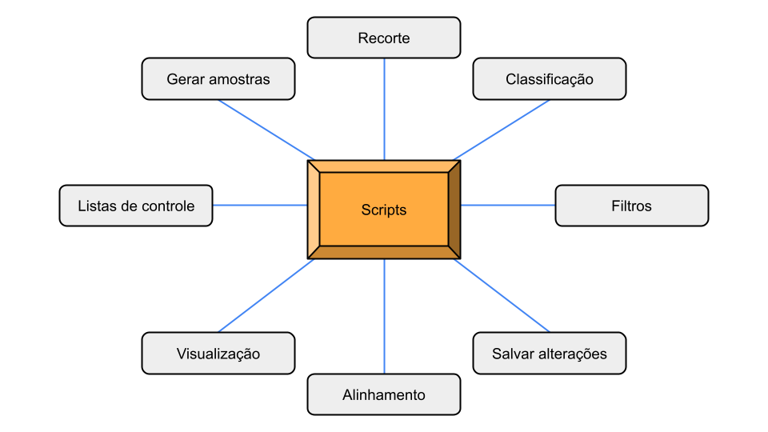

<h2 align="center"> Descrição do uso dos scripts</h2>

[//]: #(Introducao)
<h3 align="Left">Introdução</h3>

 
    Para que fosse possível realizar de forma eficiente  muitos códigos foram desenvolvidos para cada etapa do projeto.

 

[//]:#(imagem_scripts)

    
    
<i>Figura 1: Tipos de scripts.</i>

 

[//]: #(Sumario)

  
<b>Clique para ver o Sumário</b>

  <ol>
      <li><a href="#gerarpontos">Geração de Amostras</a></li>
      <li><a href="#class">Classificação</a></li>
      <li><a href="#filtro">Filtro de Moda</a></li>
      <li><a href="#rec">Recorte da classificação</a></li>
      <li><a href="#save">Salvar Alterações</a></li>
      <li><a href="#listagem">Listagem de Dados</a></li>
      <li><a href="#align">Alinhamento de Dados</a></li>
      <li><a href="#visu">Visualização de Dados</a></li>
  </ol>

[//]: #(GERAR_PONTOS)
<h3 align="left" id="gerarpontos">Geração de Amostras</h3>

 
    Através da relação entre os dados do mapeamento do Mapbiomas e Global Pasture Watch (GPW). Executado na IDE R Stúdio em ambiente de linguagem R. 
    <a href="./amostras_treinamento_sc_remap.R"><kbd> Código para gerar pontos </kbd></a>

 

[//]: #(Classificação)
<h3 align="left" id="class">Classificação</h3>

 
    Classificação utilizando o algoritmo random forest com 500 árvores realizando a classificação por cartas do IBGE e unindo os dados após termino de classificações. Foi executado em ambiente de Google Earth Engine (GEE).  
    <a href="./Classificacao.js"><kbd> Código de classificação </kbd></a>

 

[//]: #(FILTRO_DE_MODA)
<h3 align="left" id="filtro">Filtro de Moda</h3>

 
    Aplicação do filtro de moda, o script abaixo contem também filtro de mediana caso desejado. Foi executado em ambiente de Google Earth Engine (GEE).  
    <a href="./Classificacao.js"><kbd> Código de aplicação do filtro de moda </kbd></a>

 

[//]: #(RECORTE)
<h3 align="left" id="rec">Recorte da classificação</h3>

 
    Após classificação realizada, é necessário que os dados sejam distribuidos para a etapa de refinamento e posteriormente de auditoria. Os dados são recortados e reprojetados para uma projeção que permita utilzar o tamanho do pixel em metros sem necessidade de conversão e separados em pastas para cada interprete. Realizado no terminal em ambiente linux usando o WSL.  
    <a href="./recorte_automatizado.sh"><kbd> Código de recorte </kbd></a>

 

[//]: #(SALVAR_ALTERACOES)
<h3 align="left" id="save">Salvar Alterações</h3>

 
    Após os refinamentos e auditorias realizados no <a href="https://github.com/SMByC/ThRasE"> thRasE </a>, os analistas mandavam uma pasta contendo os arquivos raster usados e o dado de extensão ".yaml" que continha as alterações. Para que o dado seja salvo é necessário fixar essa alteração, então usando o dado original dentro da pasta criar uma nova versão do arquivo usando o script abaixo.  
    <a href="./salvar_em_pastas_yamlTIF.sh"><kbd> Código de salvar alterações </kbd></a>

 

[//]: #(LISTAGEM)
<h3 align="left" id="listagem">Listagem de Dados</h3>

 
    Para controle de dados, foi necessário que os dados salvos fossem listados visando entender as informações de cada dado gerado, desde extensão até mesmo valor sem dados. Essa é a etapa de checagem de dados.  
    <a href="./listar.py"><kbd> Código python de listar metadados </kbd></a>  <a href="./listar_nodata_tipo_p_lista_RASTER_v2.sh"><kbd> Código shell script de listar metadados</kbd></a>

 

[//]: #(ALINHAR_UNIR)
<h3 align="left" id="align">Alinhamento de Dados</h3>

 
    Posterior ao processo de checagem é gerado, após verificar compatibilidade dos dados, os processos de união e alinhamento e reprojeção foram aplicados.  
    <a href="./uniao_de_dados.sh"><kbd> Código de alinhar e unir rasters </kbd></a> 

 

[//]: #(ViSUALIZAÇÃO)
<h3 align="left" id="visu">Visualização de Dados</h3>

 
    Ao final dos processamentos os dados gerados são novamente inseridos no GEE para fins de visualização.  
    <a href="./mascara_estrato_amostral_Mapbiomas_GPW.js"><kbd> Código para visualização de comparação entre resultado e bases </kbd></a>   <a href="./split_panel.js"><kbd> Código para visualização de comparativo em paralelo de dados </kbd></a>

 

